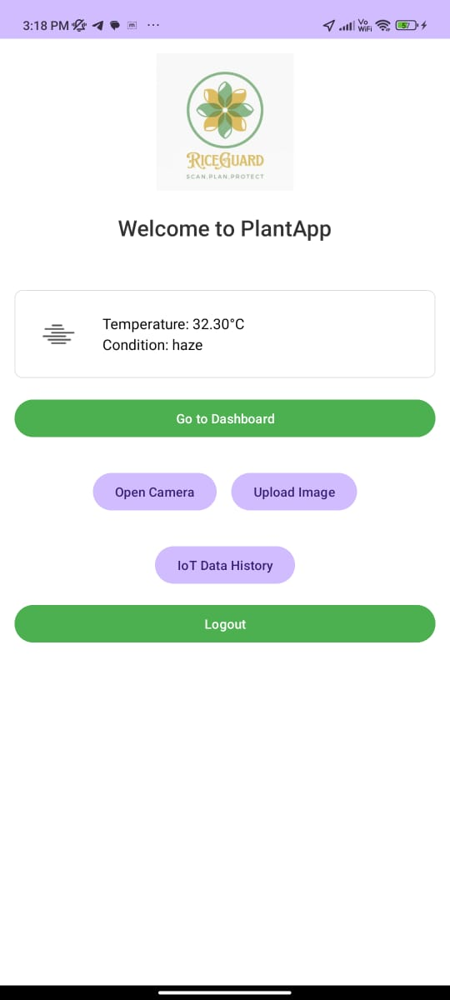

# 🌾 RiceGuard: Rice Disease Detection App

**RiceGuard** is a smart mobile app that identifies rice leaf diseases in real-time. It uses a deep learning model (PyTorch) with a Django backend. The app helps farmers detect diseases early and gives pesticide and care suggestions.

---

## 📸 App Screenshots

-<h3>🏠 Home Page</h3>

- Camera/image upload  
- Prediction output with confidence  
- Disease info and treatment  
- Weather info & IoT history  
- Care tips and disease guide  

*(Screenshots available in `/assets/screenshots`)*

---

## 💡 Features

- 📷 Capture images or upload from gallery  
- 🧠 CNN model detects diseases  
- 🌐 Django backend (REST API)  
- 💬 Gives name, confidence, pesticide, and care tips  
- ☁️ Weather info and IoT integration  
- 🔐 Login & signup support  
- 🪴 Disease prevention dashboard  

---

## 🧠 Model Details

- **Framework**: PyTorch  
- **Type**: CNN (Convolutional Neural Network)  
- **Classes**: Brown Spot, Leaf Blast, Bacterial Blight, Healthy  
- **Augmentations**: Flip, rotate, normalize  
- **Metrics**: Accuracy, Loss  

---

